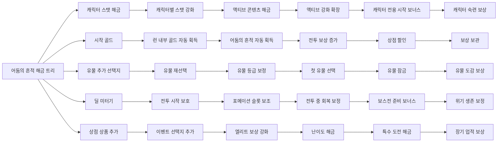

# 어둠의 흔적 해금 트리

> 목적: 어둠의 흔적을 사용해 게임 전반에 도움이 되는 콘텐츠와 편의 기능을 단계적으로 해금하는 트리 구조를 정의한다.

## 1. 기본 방향
어둠의 흔적 해금 트리는 런을 반복할수록 플레이어의 선택지와 편의성이 넓어지는 장기 성장 화면이다.

- 전투 보상으로 얻은 어둠의 흔적을 사용해 노드를 해금한다.
- 해금 효과는 대부분 런 시작 전부터 적용되는 영구 효과다.
- 단순 스탯 상승만 제공하지 않고, 캐릭터 성장, 런 경제, 유물 선택, 자동 획득, 시작 보너스처럼 게임 전반을 넓힌다.
- 트리는 처음부터 모든 방향을 보여주되, 앞 노드를 해금해야 뒤 노드가 열리는 구조로 만든다.
- 플레이어는 원하는 플레이 성향에 따라 먼저 열 가지를 선택할 수 있어야 한다.

## 2. 트리 화면 구조
화면은 육각형 또는 마름모형 노드가 선으로 이어진 형태를 기준으로 한다.

- 중앙에는 기본 해금 노드가 있다.
- 중앙에서 다섯 갈래로 뻗는다.
- 각 갈래는 6개 노드로 구성한다.
- 총 30개 해금 콘텐츠를 1차 목표로 한다.
- 각 노드는 아이콘, 이름, 짧은 설명, 현재 해금 여부를 표시한다.
- 노드를 선택하면 우측 상세 패널에 효과와 선행 조건을 보여준다.
- 이미 해금한 노드는 밝게 표시하고, 아직 잠긴 노드는 어둡게 표시한다.
- 해금 가능한 노드는 테두리를 강조한다.

## 3. 큰 가지 구성
트리는 아래 다섯 가지 방향으로 나눈다.

| 가지 | 핵심 역할 | 플레이 체감 |
|---|---|---|
| 캐릭터 성장 | 캐릭터 스탯과 액티브 콘텐츠 해금 | 좋아하는 캐릭터를 장기적으로 키운다. |
| 런 경제 | 골드, 어둠의 흔적, 자동 획득, 시작 재화 | 런 초반이 부드러워지고 반복 피로가 줄어든다. |
| 유물 연구 | 유물 선택지, 유물 등급, 유물 재선택 | 빌드 선택의 폭이 넓어진다. |
| 전투 보조 | 포메이션, 전투 정보, 회복, 방어 보정 | 런 안정성이 올라간다. |
| 진행 확장 | 난이도, 상점, 보상, 특수 콘텐츠 | 장기 목표와 도전 요소가 늘어난다. |

## 4. 트리 형태 예시
아래 구조는 문서에서 트리의 흐름을 이해하기 위한 개념도다.

## 5. 추천 해금 콘텐츠 30종

### 5.1 캐릭터 성장 가지
|  순서 | 해금 콘텐츠        | 효과 방향                                          |
| --: | ------------- | ---------------------------------------------- |
|   1 | 캐릭터 스탯 콘텐츠 해금 | 캐릭터별 기본 스탯 성장 화면을 연다.                          |
|   2 | 캐릭터별 스탯 강화 확장 | 체력, 공격력, 주문력 같은 주요 성장 노드를 더 높은 단계까지 열 수 있게 한다. |

### 5.2 런 경제 가지
| 순서 | 해금 콘텐츠 | 효과 방향 |
|---:|---|---|
| 7 | 시작 시 추가 골드 | 런 시작 시 기본 골드가 늘어난다. |
| 8 | 런 내부 골드 자동 획득 | 전투 중 일정 조건을 만족하면 골드를 자동으로 획득한다. |
| 9 | 어둠의 흔적 자동 획득 | 런 진행 중 일정 조건을 만족하면 어둠의 흔적을 추가로 획득한다. |
| 10 | 전투 보상 골드 증가 | 전투 승리 후 받는 골드가 조금 증가한다. |
| 11 | 상점 할인 | 상점에서 구매하는 일부 상품 가격이 낮아진다. |
| 12 | 보상 보관 | 선택하지 않은 일부 보상을 다음 선택 기회까지 보관할 수 있다. |

### 5.3 유물 연구 가지
| 순서 | 해금 콘텐츠 | 효과 방향 |
|---:|---|---|
| 13 | 유물 획득 시 추가 선택지 1개 | 유물을 얻을 때 고르는 후보가 하나 늘어난다. |
| 14 | 유물 재선택 | 유물 후보가 마음에 들지 않을 때 다시 뽑을 수 있다. |
| 15 | 유물 등급 보정 | 낮은 등급 유물만 연속으로 나오는 상황을 완화한다. |
| 16 | 첫 유물 선택 | 런 시작 시 소수의 유물 후보 중 하나를 고를 수 있다. |
| 17 | 유물 잠금 | 유물 선택 화면에서 마음에 드는 후보 하나를 잠시 고정할 수 있다. |
| 18 | 유물 도감 보상 | 새 유물을 처음 획득하면 작은 어둠의 흔적 보상을 받는다. |

### 5.4 전투 보조 가지
| 순서 | 해금 콘텐츠 | 효과 방향 |
|---:|---|---|
| 19 | 전투 딜 미터기 | 전투 중 포메이션 순서대로 각 타워의 누적 피해량과 비중을 볼 수 있다. |
| 20 | 전투 시작 보호막 | 전투 시작 직후 짧은 시간 동안 아군이 받는 피해를 줄인다. |
| 21 | 포메이션 슬롯 보조 | 포메이션 화면에서 추천 배치 또는 역할 표시를 볼 수 있다. |
| 22 | 전투 중 회복 보정 | 전투마다 처음 한 번, 위험한 아군에게 작은 회복을 제공한다. |
| 23 | 보스전 준비 보너스 | 보스전에 진입할 때 소량의 골드 또는 회복 기회를 얻는다. |
| 24 | 위기 생존 보정 | 런 중 한 번, 패배 직전 상황에서 아주 작은 생존 기회를 제공한다. |

### 5.5 진행 확장 가지
| 순서 | 해금 콘텐츠 | 효과 방향 |
|---:|---|---|
| 25 | 상점 상품 추가 | 상점에 등장하는 상품 후보가 늘어난다. |
| 26 | 이벤트 선택지 추가 | 이벤트에서 선택 가능한 선택지가 하나 더 등장할 수 있다. |
| 27 | 엘리트 보상 강화 | 엘리트 전투 승리 시 보상이 조금 좋아진다. |
| 28 | 난이도 해금 | 더 높은 난이도 또는 변형 난이도에 도전할 수 있다. |
| 29 | 특수 도전 해금 | 제한 조건이 있는 별도 도전 콘텐츠를 연다. |
| 30 | 장기 업적 보상 | 누적 플레이 목표를 달성하면 어둠의 흔적과 꾸미기 보상을 얻는다. |

## 6. 추천 해금 흐름
초반에는 플레이어가 체감하기 쉬운 경제와 기본 콘텐츠 해금을 먼저 배치한다.

1. 캐릭터 스탯 콘텐츠 해금
2. 시작 시 추가 골드
3. 유물 획득 시 추가 선택지 1개
4. 캐릭터 액티브 콘텐츠 해금
5. 런 내부 골드 자동 획득
6. 어둠의 흔적 자동 획득
7. 전투 딜 미터기
8. 상점 상품 추가
9. 난이도 해금
10. 특수 도전 해금

이 흐름을 기본 추천으로 두되, 실제 화면에서는 다섯 가지 가지가 동시에 보이게 한다.
플레이어가 경제를 먼저 열 수도 있고, 좋아하는 캐릭터 성장을 먼저 밀 수도 있어야 한다.

## 7. 해금 단계 감각
비용 수치는 별도 밸런스 문서에서 조정한다.
이 문서에서는 체감 단계만 정의한다.

| 단계 | 체감 | 노드 예시 |
|---|---|---|
| 초반 | 한두 번의 런으로 열 수 있는 기능 | 시작 골드, 스탯 콘텐츠, 딜 미터기 |
| 중반 | 여러 번 투자해 런 안정성을 올리는 기능 | 자동 획득, 유물 추가 선택지, 상점 할인 |
| 후반 | 빌드 다양성과 도전 목표를 여는 기능 | 첫 유물 선택, 난이도 해금, 특수 도전 |
| 장기 | 오래 플레이한 보상과 계정 단위 목표 | 장기 업적 보상, 유물 도감 보상, 캐릭터 숙련 보상 |

## 8. UI 표시 규칙
- 노드는 아이콘 중심으로 보여준다.
- 노드 이름은 짧게 유지한다.
- 상세 패널에서는 “무엇이 열리는지”와 “플레이가 어떻게 달라지는지”를 설명한다.
- 아직 잠긴 노드는 선행 노드만 알려주고, 정확한 수치 보상은 숨길 수 있다.
- 해금 가능한 노드는 밝은 테두리와 버튼으로 구분한다.
- 이미 해금한 노드는 되돌리지 않는다.
- 초기화가 필요한 성장 노드는 캐릭터 스탯/액티브 강화 화면에서만 다루고, 해금 트리 자체는 초기화하지 않는다.

## 9. 후속 결정 필요 항목
- 30개 노드를 모두 1차 버전에 넣을지, 일부는 후속 업데이트로 미룰지 결정한다.
- 각 노드의 실제 비용과 선행 조건은 별도 밸런스 작업에서 정한다.
- 시작 보너스와 자동 획득 기능이 런 난이도를 지나치게 낮추지 않는지 테스트한다.
- 위기 생존 보정이 패배 경험을 약하게 만들지 않는지 확인한다.
- 유물 추가 선택지와 재선택 기능이 빌드 완성도를 너무 쉽게 만들지 검증한다.

## 관련 문서
- [`dark-trace-currency-system.md`](obsidian://open?vault=towerdefense_pakuri_docs&file=docs%2Freference%2F6.meta%2Fdark-trace-currency-system)
- [`meta-growth-index.md`](obsidian://open?vault=towerdefense_pakuri_docs&file=docs%2Freference%2F6.meta%2Fmeta-growth-index)
- [`meta-growth-node-list.md`](obsidian://open?vault=towerdefense_pakuri_docs&file=docs%2Freference%2F6.meta%2Fmeta-growth-node-list)
- [`active-skill-growth-node-list.md`](obsidian://open?vault=towerdefense_pakuri_docs&file=docs%2Freference%2F6.meta%2Factive-skill-growth-node-list)
